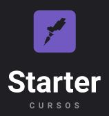
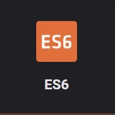
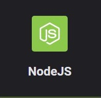
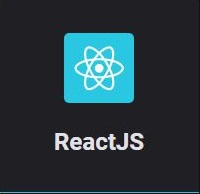
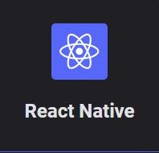

<strong>Torne-se um programador desejado</strong> 
 no mercado com esses cursos gratuitos

 
 
<h1>Sobre o projeto</h1>

Decidi postar aqui minhas idéias para a resolução dos desafios que aprendi neste curso gratuito que fiz na Rocketseat.

Decidi dividir este repositório em algumas partes que podem ser acessadas através dos links abaixo.

 

<h1>Módulos</h1>

 

 
 

Projeto desenvolvido seguindo o curso Starter, da <a target="_blank" href="https://rocketseat.com.br">Rocketseat</a>

---

Desenvolvido 💜 por <a href="https://github.com/modernfunkboss/">Filipe Batista</a>

