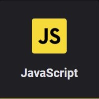

<strong>Torne-se um programador desejado</strong> 
 no mercado com esses cursos gratuitos

 
 
<h1>Sobre o projeto</h1>

Decidi postar aqui minhas idéias para a resolução dos desafios que aprendi neste curso gratuito que fiz na Rocketseat.

Decidi dividir este repositório em algumas partes que podem ser acessadas através dos links abaixo.

 

<h1>Módulos</h1>

 

 
 

Projeto desenvolvido seguindo o curso Starter, da <a target="_blank" href="https://rocketseat.com.br">Rocketseat</a>

---

<h3 align="center" >Vamos nos conectar 😉</h3>

  &ensp;
  &ensp;
  

 

    Desenvolvido 💜 por Filipe Batista 

