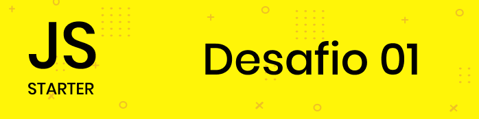
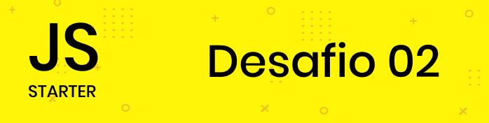

<strong>Dseafios do módulo JavaScript</strong>

 
 
<h1>Sobre o projeto</h1>

A baixo segue a relação dos desafios por etapas dentro deste curso.

 

<h1>Listas</h1>

 
 
 

 
 

Projeto desenvolvido seguindo o curso Starter, da <a target="_blank" href="https://rocketseat.com.br">Rocketseat</a>

---

Desenvolvido 💜 por <a href="https://github.com/modernfunkboss/">Filipe Batista</a>
