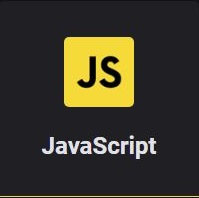

<p align="center">
<a href="https://app.rocketseat.com.br/dashboard"></a>
</p>
<p align="center">
<strong>Dseafios do módulo 1 JavaScript</strong>
</p>
<hr>
<p align="center">
<a href=""></a><br>
</p>

<h1>Exercício 1</h1>
<p>
Crie uma função que dado o objeto a seguir:
</p>

``` js
var endereco = {
 rua: "Rua dos pinheiros",
 numero: 1293,
 bairro: "Centro",
 cidade: "São Paulo",
 uf: "SP"
};
```
<p>
Retorne o seguinte conteúdo:
</p>

```
O usuário mora em São Paulo / SP, no bairro Centro, na rua "Rua dos Pinheiros" com
nº 1293.
```
[Ver o resultado](https://github.com/modernfunkboss/RS-Starter/blob/master/js/modulo-1/Desafio01-01.html)

<hr>


<h1>Exercício 2</h1>
<p>
Crie uma função que dado um intervalo (entre x e y) exiba todos número pares:
</p>

``` js
function pares(x, y) {
 // código aqui
}
pares(32, 321);

```

[Ver o resultado](https://github.com/modernfunkboss/RS-Starter/blob/master/js/modulo-1/Desafio01-02.html)

<hr>


<h1>Exercício 3</h1>

Escreva uma função que verifique se o vetor de habilidades passado possui a habilidade "Javascript"
e retorna um booleano `true/false` caso exista ou não.


``` js
function temHabilidade(skills) {
 // código aqui
}
var skills = ["Javascript", "ReactJS", "React Native"];
temHabilidade(skills); // true ou false

```

Dica: para verificar se um vetor contém um valor, utilize o método [indexOf](https://developer.mozilla.org/pt-BR/docs/Web/JavaScript/Reference/Global_Objects/Array/indexOf)

[Ver o resultado](https://github.com/modernfunkboss/RS-Starter/blob/master/js/modulo-1/Desafio01-03.html)

<hr>


<h1>Exercício 4</h1>

Escreva uma função que dado um total de anos de estudo retorna o quão experiente o usuário é:


``` js
function experiencia(anos) {
 // código aqui
}
var anosEstudo = 7;
experiencia(anosEstudo);
// De 0-1 ano: Iniciante
// De 1-3 anos: Intermediário
// De 3-6 anos: Avançado
// De 7 acima: Jedi Master
```

[Ver o resultado](https://github.com/modernfunkboss/RS-Starter/blob/master/js/modulo-1/Desafio01-04.html)

<hr>


<h1>Exercício 5</h1>

Dado o seguinte vetor de objetos:

``` js
var usuarios = [
 {
 nome: "Diego",
 habilidades: ["Javascript", "ReactJS", "Redux"]
 },
 {
 nome: "Gabriel",
 habilidades: ["VueJS", "Ruby on Rails", "Elixir"]
 }
];

```
Escreva uma função que produza o seguinte resultado:

```
O Diego possui as habilidades: Javascript, ReactJS, Redux
O Gabriel possui as habilidades: VueJS, Ruby on Rails, Elixir
```

Dica: Para percorrer um vetor você deve utilizar a sintaxe [for...of](https://developer.mozilla.org/pt-BR/docs/Web/JavaScript/Reference/Statements/for...of) e para unir valores de um array
com um separador utilize o [join](https://developer.mozilla.org/pt-BR/docs/Web/JavaScript/Reference/Global_Objects/Array/join).

[Ver o resultado](https://github.com/modernfunkboss/RS-Starter/blob/master/js/modulo-1/Desafio01-05.html)

<hr>


<br>
<br>

<p align="center">
Projeto desenvolvido seguindo o curso Starter, da <a target="_blank" href="https://rocketseat.com.br">Rocketseat</a>
</p>

---

<p align="center">Desenvolvido 💜 por <a href="https://github.com/modernfunkboss/">Filipe Batista</a></p>
