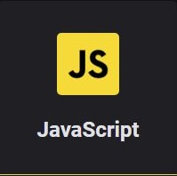
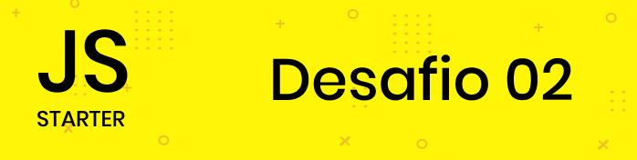

<p align="center">
<a href="https://app.rocketseat.com.br/dashboard"></a>
</p>
<p align="center">
<strong>Dseafios do módulo 2 JavaScript</strong>
</p>
<hr>
<p align="center">
<a href=""></a><br>
</p>

---

# Exercício 1

Crie um botão que ao ser clicado cria um novo elemento em tela com a forma de um quadrado
vermelho com 100px de altura e largura. Sempre que o botão for clicado um novo quadrado deve
aparecer na tela.

[Ver o resultado](https://github.com/filipeleonelbatista/RS-Starter/blob/master/js/modulo-2/Desafio-1.html)

---

# Exercício 2

Utilizando o resultado do primeiro desafio, toda vez que o usuário passar o mouse por cima de
algum quadrado troque sua cor para uma cor aleatória gerada pela função abaixo:

``` js
function getRandomColor() {
 var letters = "0123456789ABCDEF";
 var color = "#";
 for (var i = 0; i < 6; i++) {
 color += letters[Math.floor(Math.random() * 16)];
 }
 return color;
}
var newColor = getRandomColor(); // #E943F0
```

[Ver o resultado](https://github.com/filipeleonelbatista/RS-Starter/blob/master/js/modulo-2/Desafio-2.html)

---

# Exercício 3

A partir do seguinte vetor:

``` js
var nomes = ["Diego", "Gabriel", "Lucas"];
```
Preencha uma lista `<ul>` no HTML com os itens da seguinte forma:
<ul>
<li>Diego</li>
<li>Gabriel</li>
<li>Lucas</li>
</ul>

[Ver o resultado](https://github.com/filipeleonelbatista/RS-Starter/blob/master/js/modulo-2/Desafio-3.html)

---

# Exercício 4

Seguindo o resultado do exercício anterior adicione um input em tela e um botão como a seguir:

``` html
<input type="text" name="nome">
<button onClick="adicionar()">Adicionar</button>
```
Ao clicar no botão, a função `adicionar()` deve ser disparada adicionando um novo item a lista de
nomes baseado no nome preenchido no input e renderizando o novo item em tela juntos aos
demais itens anteriores. Além disso, o conteúdo do input deve ser apagado após o clique.

[Ver o resultado](https://github.com/filipeleonelbatista/RS-Starter/blob/master/js/modulo-2/Desafio-4.html)

---


<br><br>
<p align="center">
Projeto desenvolvido seguindo o curso Starter, da <a target="_blank" href="https://rocketseat.com.br">Rocketseat</a>
</p>

---

<p align="center">Desenvolvido 💜 por <a href="https://github.com/modernfunkboss/">Filipe Batista</a></p>
