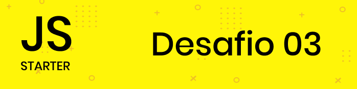

<p align="center">
<a href="https://app.rocketseat.com.br/dashboard"></a>
</p>
<p align="center">
<strong>Dseafios do módulo 3 JavaScript</strong>
</p>
<hr>
<p align="center">
<a href=""></a><br>
</p>

---

# Exercício 1

Crie uma função que recebe a idade de um usuário e retorna uma Promise que depois de *2
segundos* retornará se usuário é maior ou não que 18 anos. Se o usuário ter mais que 18 anos de
idade o resultado deve cair no `.then`, caso contrário, no `.catch`

```js
function checaIdade(idade) {
 // Retornar uma promise
}
checaIdade(20)
 .then(function() {
 console.log("Maior que 18");
 })
 .catch(function() {
 console.log("Menor que 18");
 });
```

[Ver o resultado](https://github.com/filipeleonelbatista/RS-Starter/blob/master/js/modulo-4/Desafio-1.html)

---

# Exercício 2

Crie uma tela com um `<input>` que deve receber o nome de um usuário no Github. Após digitar o
nome do usuário e clicar no botão buscar a aplicação deve buscar pela API do Github (conforme
URL abaixo) os dados de repositórios do usuário e mostrá-los em tela:

URL de exemplo: https://api.github.com/users/diego3g/repos

Basta alterar "diego3g" pelo nome do usuário.


``` html
<input type="text" name="user">
<button onclick="">Pesquisar</button>

```

Depois de preencher o input e adicionar, a seguinte lista deve aparecer abaixo:

``` html
<ul>
 <li>repo1</li>
 <li>repo2</li>
 <li>repo3</li>
 <li>repo4</li>
 <li>repo5</li>
</ul>
```

[Ver o resultado](https://github.com/filipeleonelbatista/RS-Starter/blob/master/js/modulo-4/Desafio-2.html)

---

# Exercício 3

A partir do resultado do exemplo anterior adicione um indicador de carregamento em tela no lugar
da lista apenas enquanto a requisição estiver acontecendo:

``` html
<li>Carregando...</li>
```

Além disso, adicione uma mensagem de erro em tela caso o usuário no Github não exista.

Dica: Quando o usuário não existe, a requisição irá cair no `.catch` com código de *erro 404*

[Ver o resultado](https://github.com/filipeleonelbatista/RS-Starter/blob/master/js/modulo-4/Desafio-3.html)

---

<br><br>
<p align="center">
Projeto desenvolvido seguindo o curso Starter, da <a target="_blank" href="https://rocketseat.com.br">Rocketseat</a>
</p>

---

<p align="center">Desenvolvido 💜 por <a href="https://github.com/modernfunkboss/">Filipe Batista</a></p>
